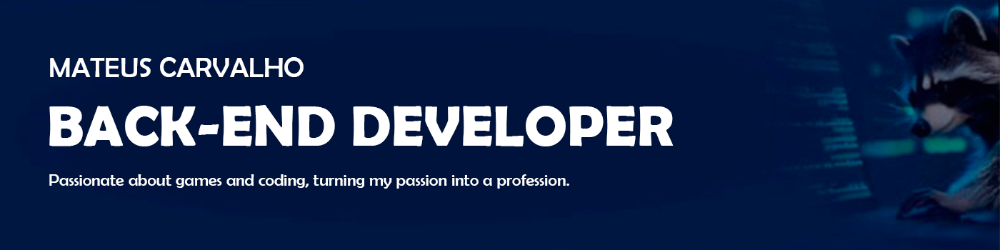

### Hi, I'm Mateus 🦝

  

<strong>An Computer Cience student at PUCRS in Porto Alegre, Brazil.</strong>

Passionate about games and coding, I've decided to turn a bit of this passion into a profession. I have a good sense of humor, although I'm a bit shy, and I love hands-on activities, especially those games that come in beautiful boxes.

If you're looking for someone with energy, dedication, and a touch of humor in the world of IT, I'm the right person for the job. 

<strong>Let's build something amazing together!</strong> 

#### Where can you find me: 

  

  

  

  
 

  
  
  
  
  
  
  

